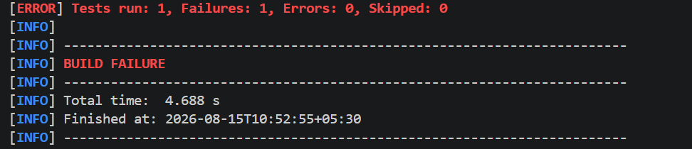
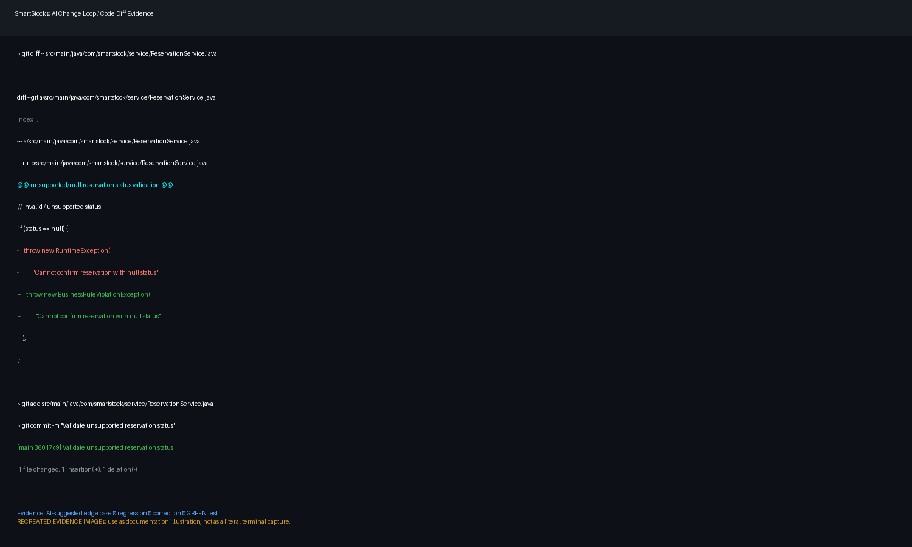
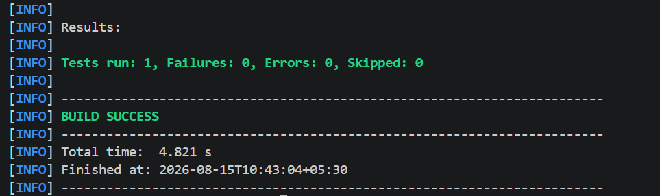
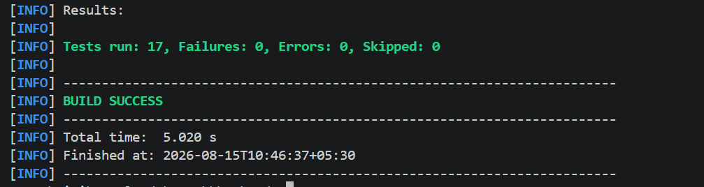
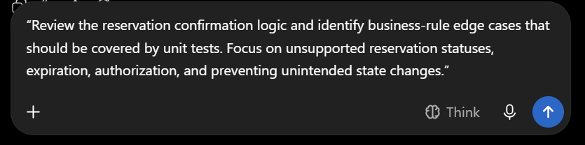

# SmartStock — AI Change Loop Evidence

## 1. AI Tool

ChatGPT was used as an engineering assistant.

AI was used for:
- identifying edge cases
- test design
- failure analysis
- implementation suggestions
- validation-order review
- regression-test planning

## 2. Initial Prompt

The initial prompt provided to the AI engineering assistant was:

> Review the SmartStock reservation service and identify important business-rule
> edge cases that should be covered by unit tests. Focus specifically on:
>
> - unsupported or invalid reservation statuses
> - reservation expiration
> - authorization/access control
> - stock restoration
> - preventing unintended state changes
> - ensuring invalid operations do not save changes to the database
>
> Suggest appropriate JUnit and Mockito test cases and explain any potential
> validation-order issues that could cause incorrect exceptions or unintended
> behavior.

## 3. Change Target

The selected edge case was:

```text
shouldRejectConfirmationForUnsupportedReservationStatus
```

The expected behavior is:

```text
Unsupported/null reservation status
        ↓
BusinessRuleViolationException
        ↓
No CONFIRMED state mutation
        ↓
No repository save
```

## 4. Iteration History

### Attempt 1 — Failure

The targeted test initially failed because the mocked reservation did not
provide all values required by the confirmation flow.

Observed failure:

```text
Expected:
BusinessRuleViolationException

Actual:
NullPointerException
```

Example cause encountered during development:

```text
Reservation.getExpiresAt() returned null
```

### Attempt 2 — Failure

The test setup was expanded with required mock values and interactions.

The flow then progressed further and exposed another issue in the
confirmation validation path.

### Attempt 3 — Correction

The reservation status validation was corrected so unsupported/null status is
rejected before confirmation continues.

## 5. Targeted GREEN Test

Command:

```powershell
mvn -Dtest=ReservationServiceTest#shouldRejectConfirmationForUnsupportedReservationStatus test
```

Observed final result:

```text
Tests run: 1
Failures: 0
Errors: 0
Skipped: 0

BUILD SUCCESS
```

## 6. Reservation Regression Suite

Command:

```powershell
mvn -Dtest=ReservationServiceTest test
```

Observed final result:

```text
Tests run: 17
Failures: 0
Errors: 0
Skipped: 0

BUILD SUCCESS
```

## 7. Full Maven Suite

Command:

```powershell
mvn test
```

Observed final result:

```text
Tests run: 17
Failures: 0
Errors: 0
Skipped: 0

BUILD SUCCESS
```

## 8. Deliberate RED Evidence





## 9. Correction Evidence



## 10. GREEN Evidence






## 11. AI Prompt Evidence



## 12. Developer Responsibility

AI output was treated as a suggestion. The developer:
- reviewed the proposed change
- edited the project
- ran tests
- interpreted failures
- reviewed the Git diff
- verified regression behavior
- committed the validated change

## 13. Evidence Timeline

```text
[Prompt]
   ↓
[AI suggestion]
   ↓
[Test/change]
   ↓
[RED failure]
   ↓
[Root-cause analysis]
   ↓
[Correction]
   ↓
[Targeted GREEN]
   ↓
[17/17 GREEN]
   ↓
[Full mvn test GREEN]
   ↓
[Git commit]
```


