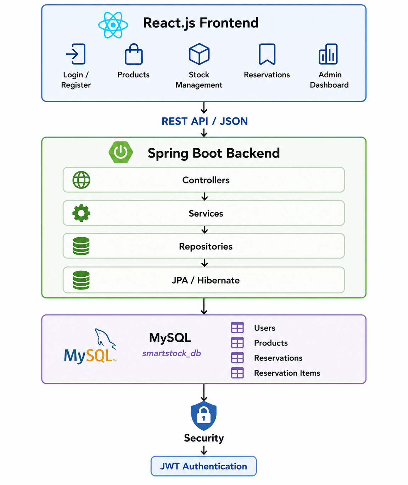
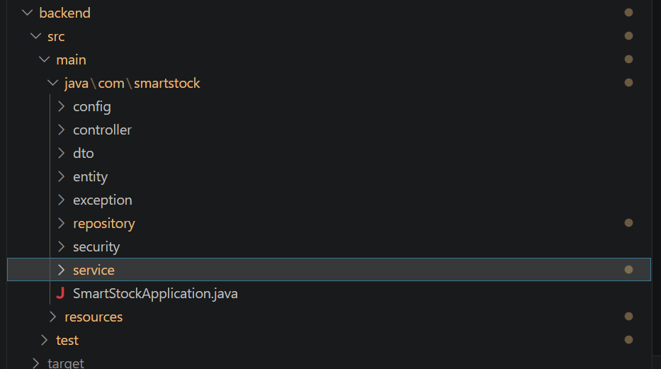
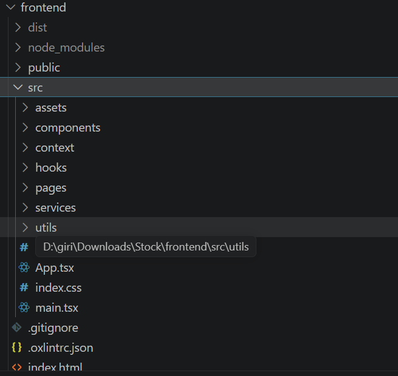
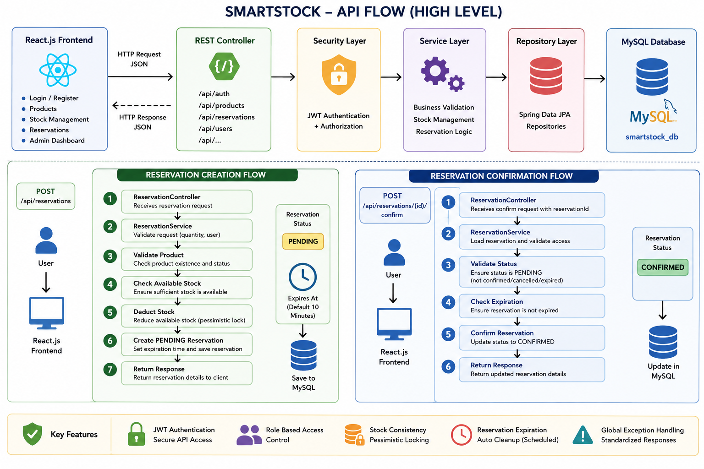
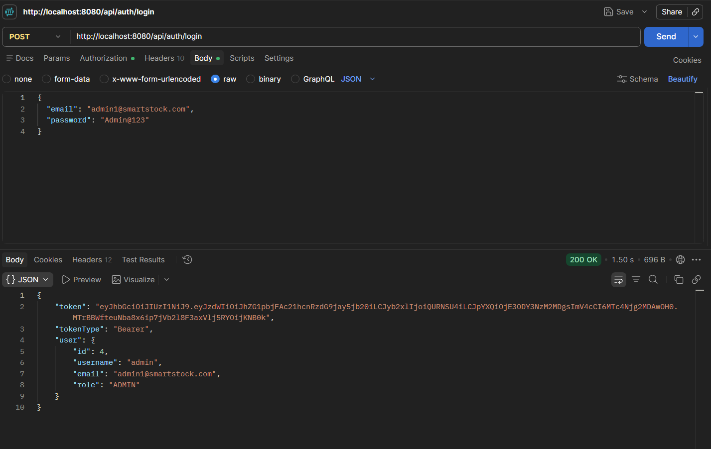

# SmartStock — Architecture Document

## 1. Purpose

SmartStock is a full-stack inventory and reservation management application.
The assessment focus is the Inventory Reservation Workflow.

## 2. System Architecture

```text
+-----------------------+
|    React Frontend     |
|       React.js        |
+-----------+-----------+
            |
            | HTTP / REST API
            v
+-----------------------+
|   Spring Boot Backend |
|                       |
| Controllers           |
| Services              |
| Security / JWT        |
| Exception Handling   |
+-----------+-----------+
            |
            | JPA / Hibernate
            v
+-----------------------+
|        MySQL          |
|    smartstock_db      |
+-----------------------+
```

## 3. Main Components

### Frontend
- React.js
- JavaScript
- HTML5
- CSS3

### Backend
- Java 21
- Spring Boot 3.3.2
- Spring Data JPA
- Spring Security
- JWT
- Hibernate
- Maven

### Database
- MySQL
- MySQL Connector/J

### Testing
- JUnit 5
- Mockito
- Maven Surefire

## 4. Backend Layering

```text
Controller
    ↓
Service
    ↓
Repository
    ↓
MySQL
```

The reservation business rules are handled in the service layer so that
validation and state transitions can be tested independently.

## 5. Security Architecture

```text
Client
  ↓
JWT Authentication
  ↓
Spring Security
  ↓
Role / Ownership Validation
  ↓
Protected Controller
```

Roles include:
- USER
- ADMIN

Reservation ownership is additionally checked before user operations.

## 6. Reservation State Model

```text
             +----------+
             | PENDING  |
             +----+-----+
                  |
        +---------+---------+
        |         |         |
      confirm   cancel    expire
        |         |         |
        v         v         v
   CONFIRMED  CANCELLED  EXPIRED
                           |
                           v
                    Restore Stock
```

## 7. Reservation Creation Flow

```text
Request
  ↓
Validate User
  ↓
Validate Product
  ↓
Validate Quantity
  ↓
Check Available Stock
  ↓
Create PENDING Reservation
  ↓
Reserve / update stock
  ↓
Return Response
```

## 8. Expiration Flow

The reservation expiration process periodically finds expired pending
reservations, restores reserved stock, changes the status to EXPIRED, and
saves the reservation.

Configured values:

```properties
reservation.expiration.minutes=10
reservation.expiration.check.rate=10000
```

## 9. Configuration

Database and JWT values are provided through environment variables:

```text
DB_URL
DB_USERNAME
DB_PASSWORD
JWT_SECRET
```

Secrets must not be committed.

## 10. Evidence









