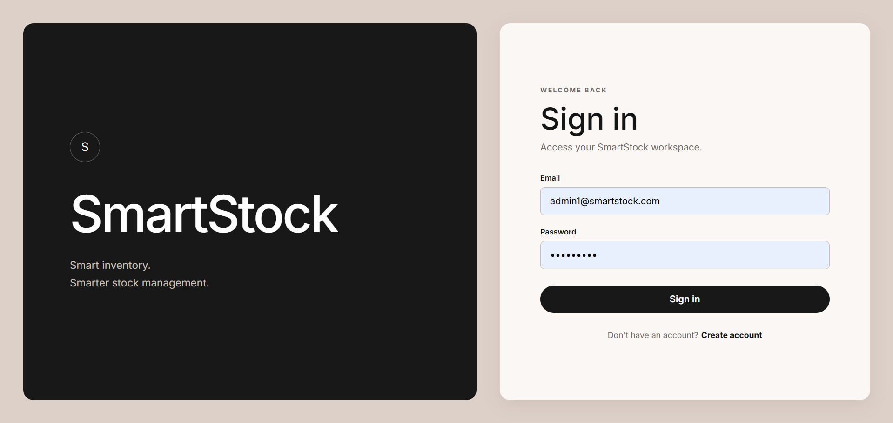
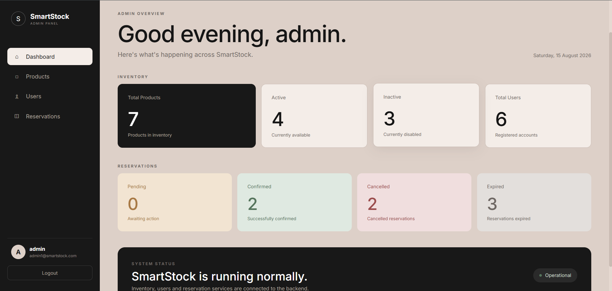
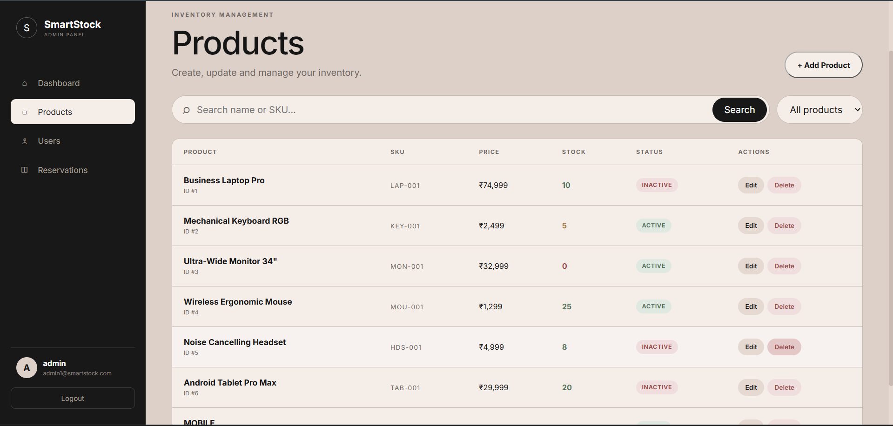
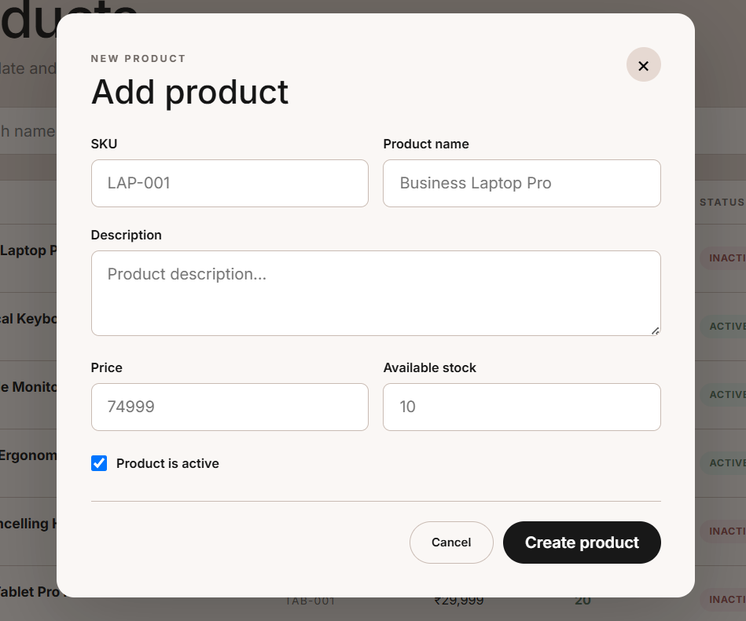
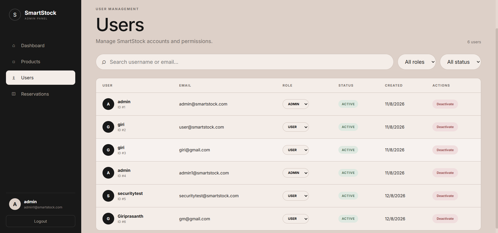
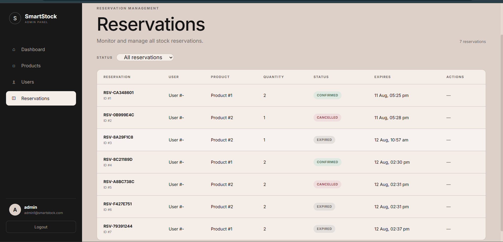
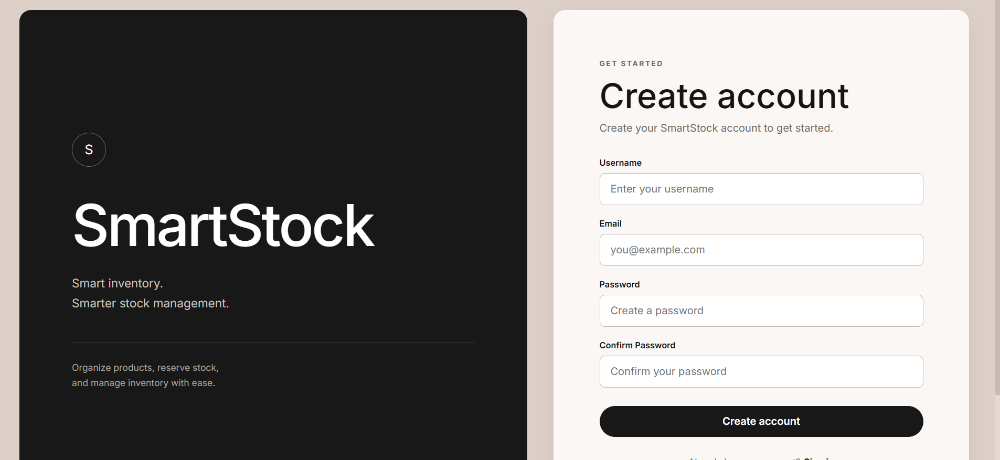
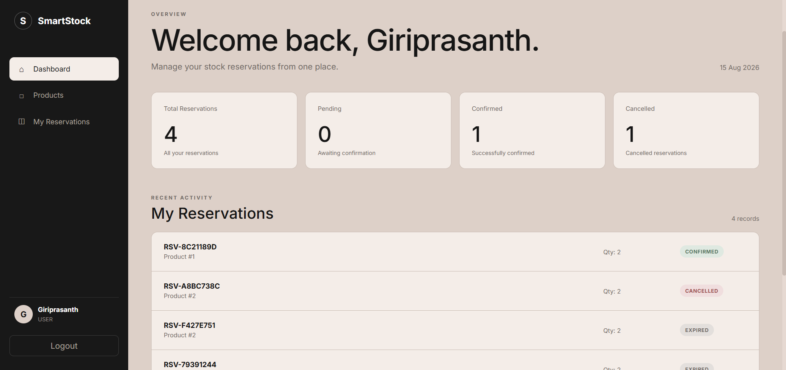
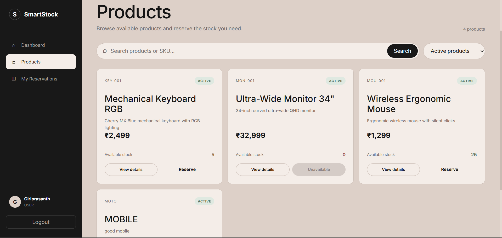
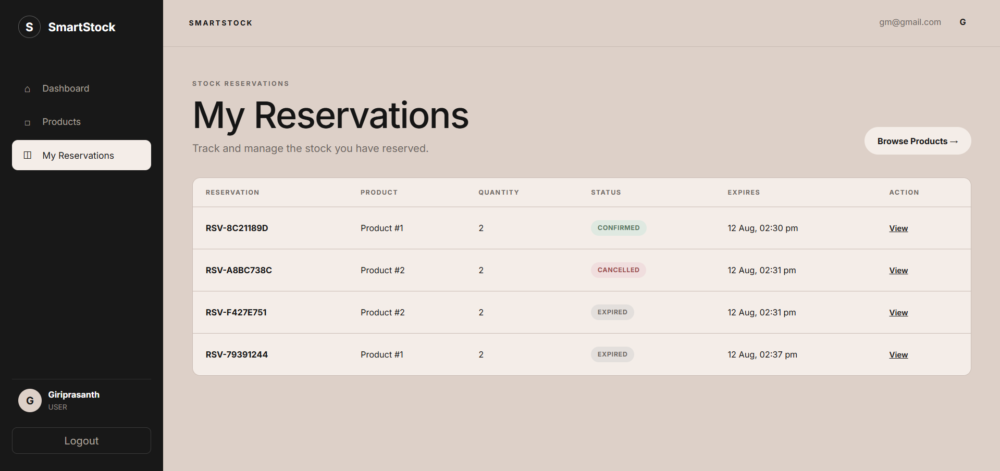

# SmartStock — Design Document

## 1. Assessment Scope

The primary assessment functionality is the Inventory Reservation Workflow.

The design concentrates on:
- business-rule validation
- reservation state transitions
- authorization
- expiration
- stock restoration
- automated regression testing

## 2. Business Rules

### Quantity
A reservation quantity must be positive.

Invalid examples:
```text
0
-5
```

### Product
A reservation cannot be created for a product that does not exist.

### Stock
A reservation cannot exceed available stock.

### Ownership
A user cannot modify another user's reservation.

### Status
Only a supported pending reservation can move to CONFIRMED.

Unsupported/null states must be rejected with:
```text
BusinessRuleViolationException
```

### Expiration
Expired reservations cannot be confirmed.

### Cancellation
Cancelling a pending reservation restores its reserved stock.

### Automatic Expiration
The scheduler:
1. Finds expired pending reservations.
2. Restores reserved stock.
3. Changes status to EXPIRED.
4. Saves the reservation.

## 3. State Transition Rules

```text
PENDING → CONFIRMED
PENDING → CANCELLED
PENDING → EXPIRED
```

Other transitions are rejected according to the service business rules.

## 4. Failure Handling

The service distinguishes between:
- missing resources
- unauthorized access
- invalid business state
- invalid quantities
- insufficient stock
- expiration-related rejection

## 5. Testing Strategy

JUnit 5 and Mockito are used to isolate reservation service behavior.

The current reservation service suite contains 17 tests with the final observed
result:

```text
Tests run: 17
Failures: 0
Errors: 0
Skipped: 0

BUILD SUCCESS
```

## 6. AI-Assisted Change Strategy

The development loop is:

```text
Requirement
    ↓
AI analysis
    ↓
Test / implementation change
    ↓
Targeted test
    ↓
Failure analysis
    ↓
Correction
    ↓
Targeted GREEN
    ↓
Full regression test
```

AI output is advisory. The developer reviews and validates every retained
change.

## 7. Evidence


## 8. User Inteface

## admin







## user





