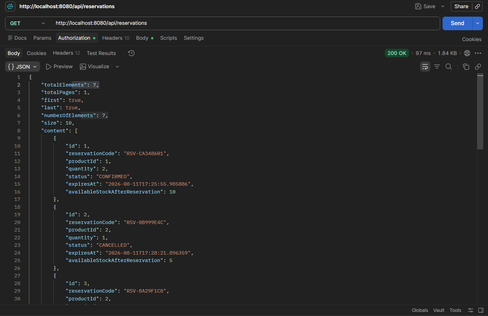

# SmartStock — User Guide

## 1. Prerequisites

Install:
- Java 21
- Maven
- MySQL
- Node.js and npm
- Git

## 2. Database Setup

Create the database:

```sql
CREATE DATABASE smartstock_db;
```

## 3. Configure Backend Environment

PowerShell:

```powershell
$env:DB_URL="jdbc:mysql://localhost:3306/smartstock_db"
$env:DB_USERNAME="root"
$env:DB_PASSWORD="<your-database-password>"
$env:JWT_SECRET="<your-jwt-secret>"
```

Do not use real credentials in documentation or Git.

## 4. Start Backend

```powershell
cd Stock
cd backend
mvn spring-boot:run
```

Backend:

```text
http://localhost:8080
```

If the root endpoint returns 403, this may simply mean that Spring Security
protects the endpoint. Test the actual authenticated application APIs.

## 5. Start Frontend

```powershell
cd frontend
npm install
npm start
```

The exact frontend development URL depends on the React setup.

## 6. Authentication

Use the application's registration/login flow.

After obtaining a JWT, send:

```text
Authorization: Bearer <JWT_TOKEN>
```

## 7. Reservation Workflow

### Create
1. Authenticate.
2. Select a valid product.
3. Provide a positive quantity.
4. Submit the reservation.
5. The reservation enters PENDING state.

### Confirm
1. Select a valid owned reservation.
2. Ensure it is still pending and not expired.
3. Confirm it.
4. The reservation becomes CONFIRMED.

### Cancel
1. Select a valid pending reservation.
2. Cancel it.
3. Reserved stock is restored.
4. The reservation becomes CANCELLED.

### Expiration
Pending reservations automatically expire after the configured duration.

Default:

```text
10 minutes
```

The expiration check runs every:

```text
10 seconds
```

## 8. API Testing

Protected requests require a JWT:

```text
Authorization: Bearer <JWT_TOKEN>
```



## 9. Troubleshooting

### Port 8080 is already in use

```powershell
netstat -ano | findstr :8080
```

Stop the appropriate process or change:

```properties
server.port=8081
```

### Database connection failure

Check:

```text
DB_URL
DB_USERNAME
DB_PASSWORD
```

and confirm MySQL is running.

### Maven not found

Use the Maven executable configured by your development environment.

## 10. Evidence

> [ADD USER-FLOW SCREENSHOTS HERE]

> [ADD AUTHENTICATION SCREENSHOT HERE]

> [ADD RESERVATION CREATION SCREENSHOT HERE]

> [ADD CONFIRMATION/CANCELLATION SCREENSHOT HERE]

> [ADD EXPIRATION/STOCK-RESTORATION SCREENSHOT HERE]
